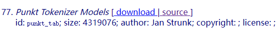
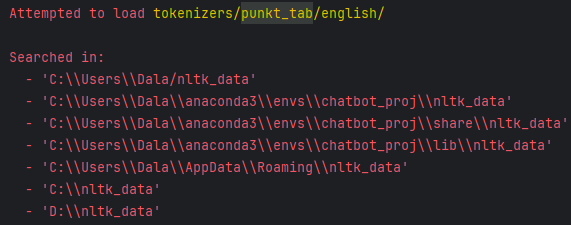

# chatbot_proj

## description
A python chatbot, based on intents.

## env
here we use conda env.  
if you need .myl contact me,or later I will upload it here.  
python=3.10  

### package manager
pip3 install

numpy==1.24.3 
(A module that was compiled using NumPy 1.x cannot be run in
NumPy 2.x as it may crash. also asked numpy>=1.23.5. I tried numpy1.9, it also not work.)

tensorflow==2.14  (version 2.16 faced some problem)

flask  

nltk  (You need manually download **punkt_tab**, or it will raise error below )
>  Resource **punkt_tab** not found.  
>  Please use the NLTK Downloader to obtain the resource:

Try any one of the following solutions.
* >Download in python console  
  >\>>>import nltk  
  >\>>>nltk.download('punkt_tab')  
  >(Not work?, try next method. )
* >Download from website
  >https://www.nltk.org/nltk_data/  
  >  
  >(Can't access this website, try next method. )
* >Download from GitHub  
  >https://github.com/nltk/nltk_data/tree/gh-pages/packages/tokenizers  
  > Download all item, find and extract ***tokenizers*** and ***corpora***   
  > put them under any of your directory (Mkdir if without folder), in console, alike to what's below.   
  > 